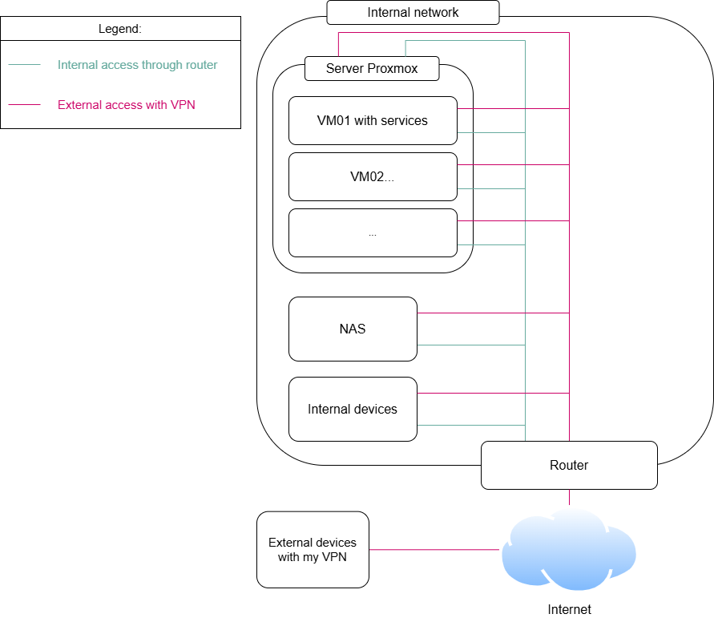
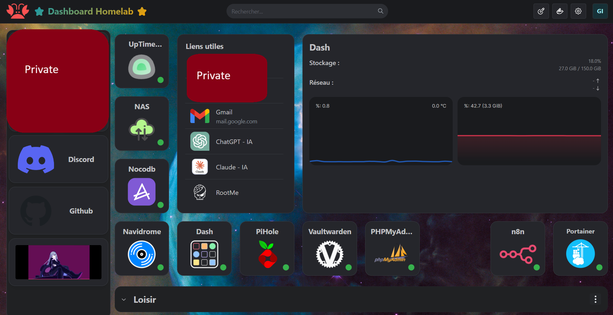
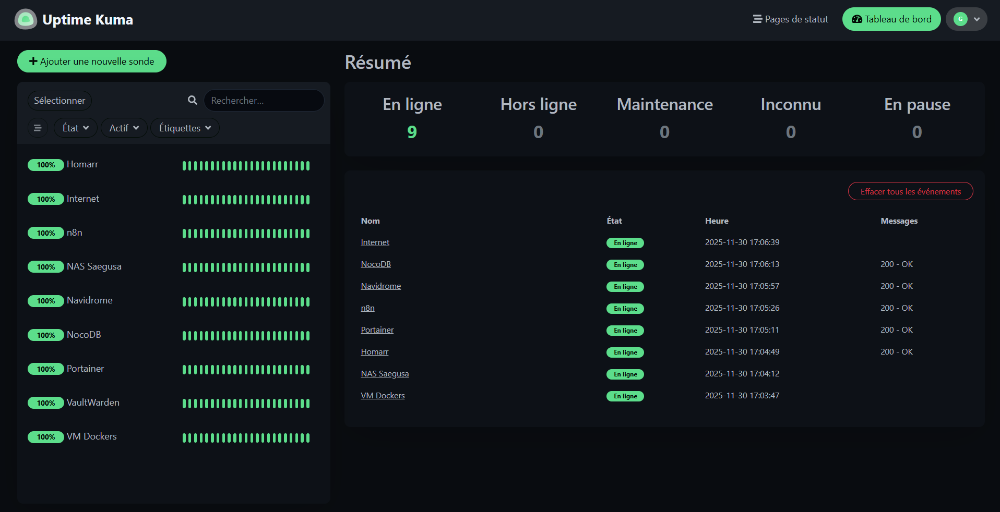

# Mon Homelab

Documentation complète de mon homelab privé avec les configurations Docker Compose

> **Disclaimer de sécurité**
> - Les IPs, domaines et informations sensibles ont été **anonymisés**
> - Les configurations sont fournies à titre d'**exemple** et doivent être adaptées à votre environnement
> - **Zéro exposition Internet** dans mon cas

---

## Vue d'ensemble

### Objectifs du projet

- Héberger des services personnels de manière privée et sécurisée
- Pratiquer Docker et Proxmox
- Centraliser les outils et services que j'utilise souvent
- Zéro exposition sur Internet dans mon cas

### Principes de conception

- **Sécurité first** : Aucun service exposé publiquement, ports par défaut modifiés, mots de passe robustes, identifiants personnalisées...
- **Accès via VPN uniquement** : VPN privé et chiffré entre mes appareils et mes VM
- **Infrastructure as Code** : Docker Compose pour tous les services
- **Monitoring complet** : Uptime Kuma pour l'alerting en cas de services down

---

## Déploiement

### Structure du repository
```
 homelab-install/
     -> image
         -> Illustrations...
     -> docker-compose
         -> Fichiers docker-compose.yml renommés pour chaque service
         -> Fichier env-exemple qui est un fichier d'exemple pour les variables utilisés dans les docker-compose.yml
         -> test-docker.sh qui est un script servant de vérifier la config et les ports de chaque docker-compose par rapport au fichier env
     -> README.md
```

### Configuration avec variables d'environnement

Tous les services sont déployés via Docker Compose avec :
- **Variables d'environnement externalisées** dans un fichier `.env` non publique (Un fichier env d'exemple est présent)
- **Volumes persistants** pour les données
- **Restart policies** configurées
- **Versions des images** fixées pour la stabilité
- **Ports hôtes modifiés** qui ne sont pas partagés


### Bonnes pratiques de sécurité

#### Ports - IMPORTANT

**Le fichier `env-exemple` utilise les ports par défaut des conteneurs.** 
**Vous DEVEZ changer les ports publiés pour le principe d'obscurcir les services (security by obscurity)**

**Exemples de modifications recommandées :**

| Service | Port par défaut | Port personnalisé (exemple) |
|---------|-----------------|---------------------------|
| Uptime Kuma | 3001 | 8301 |
| Portainer | 9000 | 9050 |
| Vaultwarden | 8080 | 8443 |
| n8n | 5678 | 6789 |
| Grafana | 3000 | 3500 |

**Configuration dans `.env` :**
```ini
# ❌ À ÉVITER (ports par défaut)
UPTIMEKUMA_PORT=3001
PORTAINER_PORT=9000

# ✅ RECOMMANDÉ (ports personnalisés)
UPTIMEKUMA_PORT=8301
PORTAINER_PORT=9050
```

**Note :** Les ports **internes** des conteneurs (dans les docker-compose) restent fixes et ne doivent **pas** être modifiés car ils servent au fonctionnement du service.

#### Credentials

- ✅ Utilisez des mots de passe **longs et complexes**
- ✅ Générez des secrets cryptographiques aléatoires
- ✅ Ne réutilisez **jamais** les mots de passe entre services
- ❌ Ne commitez **jamais** votre fichier `.env` réel

---

## Infrastructure

### Architecture



### Services

**Proxmox VE - Hyperviseur**

**Machine virtuelle principale :**
- **OS** : Debian 13 (Bookworm)
- **RAM** : 8 Go
- **vCPU** : 4 cœurs
- **Stockage** : 150 Go
- **Réseau** : Bridge Proxmox + VPN

**NAS - Synology**
- Stockage centralisé pour médias et backups

**Homarr** : Dashboard central personnalisable avec widgets pour centraliser l'accès à mes interfaces Web



**Portainer** : Gestion graphique des conteneurs Docker (similaire à Docker Desktop)

**Vaultwarden** : Gestionnaire de mots de passe auto-hébergé (compatible Bitwarden)

**NocoDB** : Base de données no-code pour la gestion de mes budgets personnels

**n8n** : Plateforme d'automatisation de workflows (alternative à Zapier)

**Navidrome** : Serveur de streaming musical personnel

**Uptime Kuma** : Supervision et alerting des services

**Dash.** : Dashboard des statistiques système en temps réel

**Pi-hole** : Blocage de publicités et filtrage DNS au niveau réseau

---

## Supervision

### Configuration Uptime Kuma

**Monitors configurés :**

#### Services critiques 🔴

| Service | Type | Cible | Intervalle | Alerte si |
|---------|------|-------|------------|-----------|
| **Vaultwarden** | HTTP(s) (Ignore SSL) | `https://X.x.x.x:XXXX` | 5 min | Down > 15 min |
| **NAS Synology** | Ping | `X.x.x.x` (NAS) | 5 min | 3 échecs consécutifs |

#### Services importants 🟡

| Service | Type | Cible | Intervalle | Alerte si |
|---------|------|-------|------------|-----------|
| **Homarr** | HTTP(s) | `http://x.x.x.x:XXXX` | 10 min | Down >30 min |
| **Portainer** | HTTP(s) | `http://x.x.x.x:XXXX` | 10 min | Down >30 min |
| **n8n** | HTTP(s) | `http://x.x.x.x:XXXX` | 15 min | Down >30 min |

#### Services confort 🟢

| Service | Type | Cible | Intervalle | Alerte si |
|---------|------|-------|------------|-----------|
| **Navidrome** | HTTP(s) | `http://x.x.x.x:XXXX` | 15 min | Down >1h |
| **NocoDB** | HTTP(s) | `http://x.x.x.x:XXXX` | 15 min | Down >1h |
| **Internet** | Ping | `1.1.1.1` | 10 min | Info (pas critique) |



### Notifications

**Webhook Discord configuré** pour recevoir les alertes sur un serveur personnel

---

## Ressources et liens utiles

### Documentation officielle

- [Docker Documentation](https://docs.docker.com/)
- [Docker Compose](https://docs.docker.com/compose/)
- [Proxmox Documentation](https://pve.proxmox.com/pve-docs/)

### Services

- [Homarr](https://homarr.dev/)
- [Vaultwarden](https://github.com/dani-garcia/vaultwarden)
- [Uptime Kuma](https://github.com/louislam/uptime-kuma)
- [Uptime Kuma - Slash-Root](https://slash-root.fr/421/)
- [Portainer](https://www.portainer.io/)
- [n8n](https://n8n.io/)
- [Navidrome](https://www.navidrome.org/)
- [NocoDB](https://www.nocodb.com/)
- [Pi-hole](https://pi-hole.net/)

---

## Statistiques du projet

**Date de création :** Octobre 2024


**Utilisation ressources :**
- RAM : ~4 Go / 8 Go
- CPU : <20% en moyenne
- Stockage : ~30 Go / 150 Go


**Compétences développées :**
- Virtualisation (Proxmox)
- Conteneurisation (Docker & Docker Compose)
- IaC (Infra as Code)
- Monitoring et supervision de services
- Sécurité et hardening de services

---

## Prochaines améliorations envisagées

### Court terme
- [ ] Créer des workflows n8n pour automatiser mes tâches / automatiser ma veille technologique
- [ ] Automatiser le déploiement et la maj du Homelab via Ansible

### Moyen terme
- [ ] Mettre en place des backups automatiques réguliers
- [ ] Explorer d'autres services
- [ ] Tester des outils dans des environnements isolés

### Long terme
- [ ] Ajouter une deuxième VM pour redondance critique
- [ ] Home Assistant (le jour où j'achète des objets connectés)
- [ ] Monitoring avancé

---

## 💬 Feedback & Contact

Ce homelab est mon premier projet perso qui me permet d'apprendre et qui me sert au quotidien. Si vous avez :
- Des suggestions d'amélioration
- Des retours
- Des questions
- Des idées de services

N'hésitez pas à ouvrir une **issue** ou une **discussion** sur ce repo !

*Dernière mise à jour : Décembre 2025*
